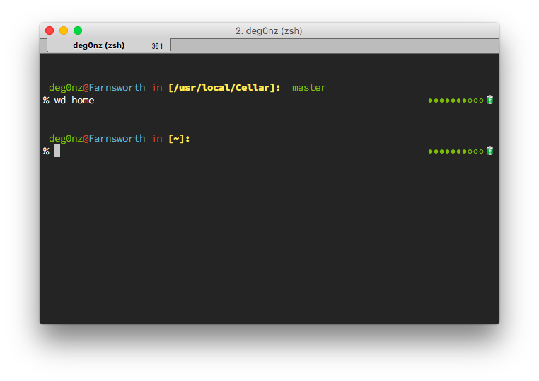

## My oh-my-zsh prompt

####Screenshot:

#### Description:

I used many parts from [Steve Losh's extravagant zsh prompt](http://stevelosh.com/blog/2010/02/my-extravagant-zsh-prompt/) and customized the **battery.py**.   
Here's his GitHub account (most credits go to him!): [https://github.com/sjl/](https://github.com/sjl/)

Changes in **battery.py** are:

* Battery status icons changed from triangles (▶/▷) to dots (●/○)
* Added a Unicode sign to the battery state indicate wheter my MacBook is connected to a power source or runs on battery

As in the battery.py from sjl, the colors of the dots change from green to yellow to red with draining battery and it reacts to git repositories.

I use this prompt with [iTerm2](https://www.iterm2.com) and the color theme is [SMYCK](http://color.smyck.org) by hukl.
The font in the screenshot is [Source Code Pro](https://github.com/adobe-fonts/source-code-pro) by Adobe.

Feel free to customize, share and use it as you want!

## Installation

You'll need (if not already installed):

* [zsh](http://www.zsh.org) (you can install it via [Homebrew](http://brew.sh) on a mac)
* [OH-MY-ZSH](https://github.com/robbyrussell/oh-my-zsh)
* Python (should come with OSX)

Just copy the `deg0nz.zsh-theme` file to `~/.oh-my-zsh/themes` and put the `battery.py` anywhere you want (I put mine to `~/.oh-my-zsh/tools`).  

Then write the path to your `battery.py` into the `BAT_CHARGE` variable in `deg0nz.zsh-theme` (line 2).

Choose the theme in your `.zshrc` file and you should be ready to go :)
